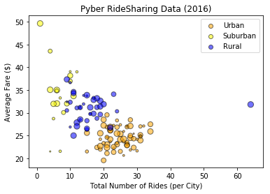
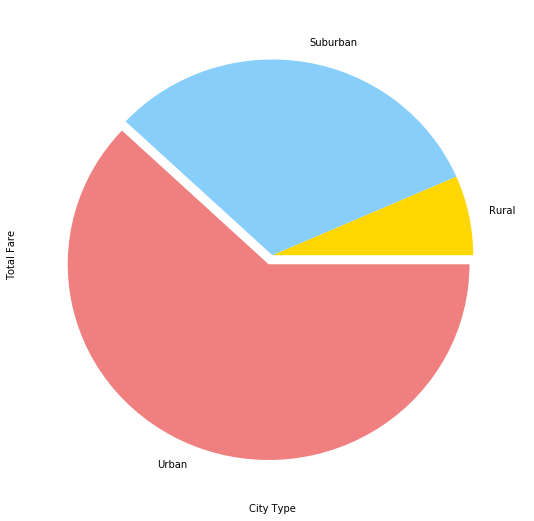
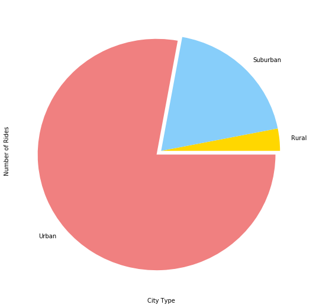

```python
# %matplotlib notebook
# Import Dependencies
import matplotlib.pyplot as plt
import pandas as pd
import numpy as np
import seaborn as sns
```


```python
# Import ride data into pandas from CSV

ride_df = pd.read_csv("/Users/arjun.maniyar/Desktop/Git_MoveTo/02-Homework/05-Matplotlib/Instructions/Pyber/raw_data/ride_data.csv")
ride_df.head()
```


<div>
<style scoped>
    .dataframe tbody tr th:only-of-type {
        vertical-align: middle;
    }

    .dataframe tbody tr th {
        vertical-align: top;
    }

    .dataframe thead th {
        text-align: right;
    }
</style>
<table border="1" class="dataframe">
  <thead>
    <tr style="text-align: right;">
      <th></th>
      <th>city</th>
      <th>date</th>
      <th>fare</th>
      <th>ride_id</th>
    </tr>
  </thead>
  <tbody>
    <tr>
      <th>0</th>
      <td>Sarabury</td>
      <td>2016-01-16 13:49:27</td>
      <td>38.35</td>
      <td>5403689035038</td>
    </tr>
    <tr>
      <th>1</th>
      <td>South Roy</td>
      <td>2016-01-02 18:42:34</td>
      <td>17.49</td>
      <td>4036272335942</td>
    </tr>
    <tr>
      <th>2</th>
      <td>Wiseborough</td>
      <td>2016-01-21 17:35:29</td>
      <td>44.18</td>
      <td>3645042422587</td>
    </tr>
    <tr>
      <th>3</th>
      <td>Spencertown</td>
      <td>2016-07-31 14:53:22</td>
      <td>6.87</td>
      <td>2242596575892</td>
    </tr>
    <tr>
      <th>4</th>
      <td>Nguyenbury</td>
      <td>2016-07-09 04:42:44</td>
      <td>6.28</td>
      <td>1543057793673</td>
    </tr>
  </tbody>
</table>
</div>


```python
# Import city data into pandas from CSV

city_df = pd.read_csv("/Users/arjun.maniyar/Desktop/Git_MoveTo/02-Homework/05-Matplotlib/Instructions/Pyber/raw_data/city_data.csv")
city_df.head()
```


<div>
<style scoped>
    .dataframe tbody tr th:only-of-type {
        vertical-align: middle;
    }

    .dataframe tbody tr th {
        vertical-align: top;
    }

    .dataframe thead th {
        text-align: right;
    }
</style>
<table border="1" class="dataframe">
  <thead>
    <tr style="text-align: right;">
      <th></th>
      <th>city</th>
      <th>driver_count</th>
      <th>type</th>
    </tr>
  </thead>
  <tbody>
    <tr>
      <th>0</th>
      <td>Kelseyland</td>
      <td>63</td>
      <td>Urban</td>
    </tr>
    <tr>
      <th>1</th>
      <td>Nguyenbury</td>
      <td>8</td>
      <td>Urban</td>
    </tr>
    <tr>
      <th>2</th>
      <td>East Douglas</td>
      <td>12</td>
      <td>Urban</td>
    </tr>
    <tr>
      <th>3</th>
      <td>West Dawnfurt</td>
      <td>34</td>
      <td>Urban</td>
    </tr>
    <tr>
      <th>4</th>
      <td>Rodriguezburgh</td>
      <td>52</td>
      <td>Urban</td>
    </tr>
  </tbody>
</table>
</div>


```python
tot_drivers_city = city_df["driver_count"]
tot_drivers_city.head()
```


    0    63
    1     8
    2    12
    3    34
    4    52
    Name: driver_count, dtype: int64


```python
# City = ride_df["city"]
# Date = ride_df["date"]
# Fare = ride_df["fare"]
# Ride_ID = ride_df["ride_id"]
# driver_count = city
merged_df = pd.merge(ride_df, city_df, on="city")
merged_df.head()
```


<div>
<style scoped>
    .dataframe tbody tr th:only-of-type {
        vertical-align: middle;
    }

    .dataframe tbody tr th {
        vertical-align: top;
    }

    .dataframe thead th {
        text-align: right;
    }
</style>
<table border="1" class="dataframe">
  <thead>
    <tr style="text-align: right;">
      <th></th>
      <th>city</th>
      <th>date</th>
      <th>fare</th>
      <th>ride_id</th>
      <th>driver_count</th>
      <th>type</th>
    </tr>
  </thead>
  <tbody>
    <tr>
      <th>0</th>
      <td>Sarabury</td>
      <td>2016-01-16 13:49:27</td>
      <td>38.35</td>
      <td>5403689035038</td>
      <td>46</td>
      <td>Urban</td>
    </tr>
    <tr>
      <th>1</th>
      <td>Sarabury</td>
      <td>2016-07-23 07:42:44</td>
      <td>21.76</td>
      <td>7546681945283</td>
      <td>46</td>
      <td>Urban</td>
    </tr>
    <tr>
      <th>2</th>
      <td>Sarabury</td>
      <td>2016-04-02 04:32:25</td>
      <td>38.03</td>
      <td>4932495851866</td>
      <td>46</td>
      <td>Urban</td>
    </tr>
    <tr>
      <th>3</th>
      <td>Sarabury</td>
      <td>2016-06-23 05:03:41</td>
      <td>26.82</td>
      <td>6711035373406</td>
      <td>46</td>
      <td>Urban</td>
    </tr>
    <tr>
      <th>4</th>
      <td>Sarabury</td>
      <td>2016-09-30 12:48:34</td>
      <td>30.30</td>
      <td>6388737278232</td>
      <td>46</td>
      <td>Urban</td>
    </tr>
  </tbody>
</table>
</div>


```python
# city_group = ride_df.groupby('city')

# avg_fares = city_group['fare'].mean()

# avg_fares.head()
#Total Rides by City Type
city_group = merged_df.groupby(['type','city'])
tot_rides_city = city_group['ride_id'].count()

#urban
urban_id_count = "Urban"
just_urban_count  = tot_rides_city.loc[urban_id_count]

#rural
rural_id_count = "Rural"
just_rural_count  = tot_rides_city.loc[rural_id_count]

#Suburban
sub_id_count = "Suburban"
just_sub_count  = tot_rides_city.loc[sub_id_count]
just_sub_count.head()

```


    city
    Anitamouth       9
    Campbellport    15
    Carrollbury     10
    Clarkstad       12
    Conwaymouth     11
    Name: ride_id, dtype: int64


```python
# city_group = merged_df.groupby(['type','city'])
# tot_city_rides = city_group['ride_id'].count()
```


```python

#urban
urban_id_count = "Urban"
just_urban_count  = tot_rides_city.loc[urban_id_count]

#rural
rural_id_count = "Rural"
just_rural_count  = tot_rides_city.loc[rural_id_count]

#Suburban
sub_id_count = "Suburban"
just_sub_count  = tot_rides_city.loc[sub_id_count]
just_sub_count.head()
```


    city
    Anitamouth       9
    Campbellport    15
    Carrollbury     10
    Clarkstad       12
    Conwaymouth     11
    Name: ride_id, dtype: int64


```python
#Average Fare ($) Per City
urban_data = merged_df.groupby(['type','city'])
avg_fare = urban_data['fare'].mean()

#urban
urban_id_avg = "Urban"
just_urban_avg = avg_fare.loc[urban_id_avg]

#rural
rural_id_avg = "Rural"
just_rural_avg = avg_fare.loc[rural_id_avg]
just_rural_avg.head()

#rural
sub_id_avg = "Suburban"
just_sub_avg = avg_fare.loc[sub_id_avg]
just_sub_avg.head()
```


    city
    Anitamouth      37.315556
    Campbellport    33.711333
    Carrollbury     36.606000
    Clarkstad       31.051667
    Conwaymouth     34.591818
    Name: fare, dtype: float64


```python
# type_merged = merged_df.groupby('type')

# plt.legend(loc="best")
# plt.scatter(tot_rides_city, avg_fares,  s=tot_drivers_city)
# sns.set()
# plt.show()

# type_urban = merged_df.loc[(merged_df["type"] = ]
plt.title("Pyber RideSharing Data (2016)")
plt.xlabel("Total Number of Rides (per City)")
plt.ylabel("Average Fare ($)")

# # colors = ["orange", "blue", "yellow"]
plt.scatter(just_urban_count, just_urban_avg, marker="o", facecolors="orange", edgecolors="black", s=tot_drivers_city, alpha=0.55, label = "Urban")
plt.scatter(just_rural_count, just_rural_avg, marker="o", facecolors="yellow", edgecolors="black", s=tot_drivers_city, alpha=0.55, label = "Suburban")
plt.scatter(just_sub_count, just_sub_avg, marker="o", facecolors="blue", edgecolors="black", s=tot_drivers_city, alpha=0.55, label = "Rural")
plt.legend(loc="best")

```


    <matplotlib.legend.Legend at 0x1a16a95e80>





```python
citygrp = city_df.groupby('type')

tot_drivers = citygrp['driver_count'].sum()

tot_drivers
```


    type
    Rural        104
    Suburban     638
    Urban       2607
    Name: driver_count, dtype: int64


```python
explode =(0,0,0.05)
colors = ['gold', 'lightskyblue', 'lightcoral']
drivers_chart = tot_drivers.plot(kind='pie', explode = explode, colors=colors, figsize=(9,9))

# Set the xlabel and ylabel using class methods
drivers_chart.set_xlabel("City Type")
drivers_chart.set_ylabel("Number of Drivers")


plt.show()
```


```python
type_merged = merged_df.groupby('type')

tot_fare = type_merged['fare'].sum()

tot_fare
```


    type
    Rural        4255.09
    Suburban    20335.69
    Urban       40078.34
    Name: fare, dtype: float64


```python
fare_chart = tot_fare.plot(kind='pie', explode = explode, colors=colors, figsize=(9,9))

# Set the xlabel and ylabel using class methods
fare_chart.set_xlabel("City Type")
fare_chart.set_ylabel("Total Fare")


plt.show()
```





```python
tot_rides = type_merged['ride_id'].count()

tot_rides
```


    type
    Rural        125
    Suburban     657
    Urban       1625
    Name: ride_id, dtype: int64


```python
rides_chart = tot_drivers.plot(kind='pie', explode = explode, colors=colors, figsize=(9,9))

# Set the xlabel and ylabel using class methods
rides_chart.set_xlabel("City Type")
rides_chart.set_ylabel("Number of Rides")


plt.show()
```




